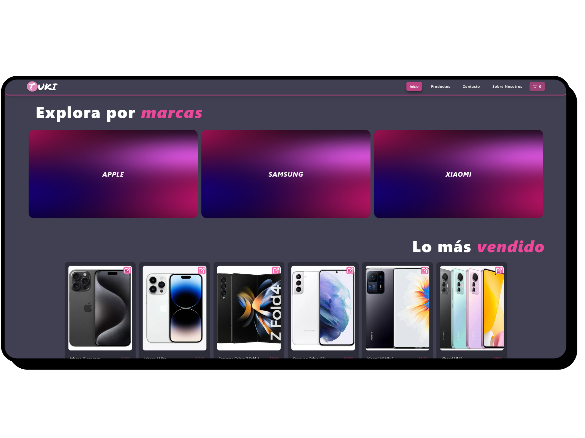

# Tuki-Ecommerce (ReactJS Vite - Proyecto Coderhouse)

Proyecto realizado para el curso de ReactJS dado por Coderhouse, Se trata de un ecommerce donde se venden telefonos de marcas reconocidas como apple, samsung y xiaomi.

# Habilidades :computer:

## :collision: Características

- Diseño limpio y responsivo
- Implementacion de context para el manejo del carrito
- Navegación intuitiva y fácil de usar
- Código amigable para SEO
- Utilizacion de React router dom
- Proyecto enlazado con el servicio de firestore

## :collision: Instalación :rocket:

1. Clona este repositorio
2. Ejecuta `npm install` para instalar las dependencias
3. Ejecuta `npm run dev` para iniciar el servidor de desarrollo

## Uso :wink:

Para usar el sitio web, navega a `http://localhost:5173` en tu navegador.
